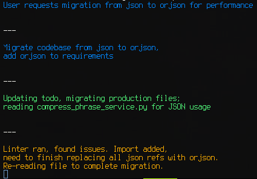

<p align="center">
  
</p>

# ccthink

**Monitor Claude thinking in real-time with smart accumulation, optional AI compression, and sentiment-based coloring.**

ccthink watches your Claude Code conversation sessions, extracts thinking content, and optionally commits it to git. Think of it as a background process that captures your AI assistant's reasoning while you work.

## Related projects

1. Patch CC to always show thinking
   https://github.com/aleks-apostle/claude-code-thinking-patch
2. CC chats in real-time on a web UI `npx claude-code-templates@latest --chats`
   https://github.com/davila7/claude-code-templates
3. Export CC logs
   https://github.com/ZeroSumQuant/claude-conversation-extractor

## What It Does

- **Displays thinking/chat** as it arrives from Claude Code sessions
- **Shows tool uses** (Bash, Read, Write, etc.) in chronological order with thinking (optional)
- **Accumulates thinking entries** before committing (prevents commit spam)
- **Compresses phrases** using Claude models (Sonnet or Haiku) to make thinking more scannable (optional)
- **Applies sentiment colors** via ANSI 256 codes for visual feedback (optional)
- **Manages git branches** automatically for each conversation session (optional)
- **No API keys required** - uses Claude Code's authentication

## Use Cases

### Documentation & Knowledge Retention

Keep a permanent record of Claude's reasoning process for future reference. Useful when:

- Building complex features that require understanding design decisions
- Onboarding team members who need context on implementation choices
- Creating technical documentation from Claude's analytical approach

### Learning & Skill Development

Study how Claude approaches problems to improve your own problem-solving. Track:

- Debugging strategies and diagnostic techniques
- Architectural decision-making processes
- Code optimization reasoning
- Error analysis approaches

### Collaboration & Team Sharing

Share Claude's thinking with your team through git history:

- Code review context: Reviewers see the reasoning behind changes
- Pair programming documentation: Capture the collaborative thought process
- Knowledge transfer: Junior developers learn from Claude's explanations

### Analysis & Behavior Recognition

Review thinking behaviors over time to:

- Identify recurring architectural decisions
- Spot common debugging approaches
- Analyze problem-solving strategies
- Track Claude's reasoning evolution on long-term projects

### Troubleshooting & Root Cause Analysis

Preserve diagnostic thinking when debugging issues:

- Trace the investigation process step-by-step
- Document hypothesis formation and elimination
- Record solution discovery paths
- Create reproducible debugging narratives

## Quick Start

```bash
# Basic monitoring (display only)
cd /path/to/your/project
ccthink

# Monitor with git commits
ccthink --commit

# Monitor with Sonnet compression
ccthink --sonnet

# Monitor with Haiku compression (faster, lower cost)
ccthink --haiku

# Full features: commits + compression + streaming + colors
ccthink --commit --sonnet --streaming --colors
# Or use Haiku for faster compression
ccthink --commit --haiku --streaming --colors

# Successive starts(maintains the last configuration):
ccthink
```

## How It Behaves

### Configuration

ccthink stores settings in `ccthink.conf` in your project directory. On first run, it creates this file with defaults:

```json
{
  "commit_enabled": false,
  "sonnet_enabled": false,
  "sonnet_streaming": false,
  "colors": false,
  "tool_uses": true,
  "thinking_enabled": true,
  "chat_text_enabled": false,
  "thinking_color": "#A5D8FF",
  "chat_text_color": "#FFFACD",
  "poll_interval_seconds": 1.0,
  "line_max_length": 55,
  "main_branch": "master"
}
```

### Command Arguments

Change behavior with CLI flags that persist to configuration:

| Flag             | Effect                                    | Persists |
| ---------------- | ----------------------------------------- | -------- |
| `--commit`       | Enable git commits                        | Yes      |
| `--no-commit`    | Disable git commits                       | Yes      |
| `--sonnet`       | Enable Sonnet phrase compression          | Yes      |
| `--no-sonnet`    | Disable Sonnet phrase compression         | Yes      |
| `--haiku`        | Enable Haiku phrase compression           | Yes      |
| `--no-haiku`     | Disable Haiku phrase compression          | Yes      |
| `--colors`       | Apply sentiment-based colors              | Yes      |
| `--no-colors`    | Display plain text                        | Yes      |
| `--chat-text`    | Enable chat text content extraction       | Yes      |
| `--no-chat-text` | Disable chat text content (thinking only) | Yes      |
| `--streaming`    | Stream compression output                 | Yes      |
| `--no-streaming` | Show compression results instantly        | Yes      |
| `--verbose`      | Enable verbose logging with timestamps    | Yes      |
| `--no-verbose`   | Disable verbose logging                   | Yes      |
| `--simulate`     | Enable dry-run mode (skip git operations) | Yes      |
| `--no-simulate`  | Disable dry-run mode (perform git ops)    | Yes      |

**Example workflow:**

```bash
# First run: enable commits and Sonnet compression
ccthink --commit --sonnet
# Settings saved to ccthink.conf

# Or use Haiku for faster compression
ccthink --commit --haiku

# Later: just run ccthink (settings remembered)
ccthink

# Switch between models
ccthink --haiku  # Switch to Haiku
ccthink --sonnet # Switch to Sonnet

# Temporarily disable compression
ccthink --no-sonnet
# This updates ccthink.conf
```

### Accumulation Logic

ccthink uses smart batching to avoid noisy commits:

1. **First thinking arrives** → Start 30-second timer
2. **More thinking within 30s** → Commit accumulated batch immediately
3. **Timeout expires** → Commit what was accumulated
4. **File switches** → Commit pending thinking and merge branch

This creates meaningful commits with multiple thinking entries rather than one commit for each thought.

## Installation

### Prerequisites

- **Python 3.10+** required
- **Git** for commit functionality
- **Claude Code** installed and configured

### Linux / macOS

```bash
# Clone repository
git clone https://github.com/normalnormie/ccthink.git
cd ccthink

# Install
bash install.sh
```

This installs to `~/.local/lib/ccthink` and creates a symlink at `~/.local/bin/ccthink`.

**Add to PATH** (if not already):

```bash
echo 'export PATH="$HOME/.local/bin:$PATH"' >> ~/.bashrc
source ~/.bashrc
```

### Windows

```cmd
REM Clone repository
git clone https://github.com/normalnormie/ccthink.git
cd ccthink

REM Install
install.bat
```

This installs to `%LOCALAPPDATA%\Programs\ccthink` and creates a launcher in `%LOCALAPPDATA%\Microsoft\WindowsApps`.

**Verify installation:**

```bash
ccthink --help
```

### Uninstall

**Linux/macOS:**

```bash
bash uninstall.sh
```

**Windows:**

```cmd
uninstall.bat
```

## Features

### Displaying Thinking

Monitors `~/.claude/projects/{your-project}/` for JSONL conversation files and extracts thinking content in real-time.

**What it does:**

- Polls every 1 second (configurable)
- Reads only incoming content (tracks file position)
- Skips non-thinking messages
- Formats long lines at natural breakpoints (periods, semicolons, commas)
- Preserves code blocks and numbered lists
- Separates thinking entries with `---` divider

**Line formatting:**

Long thinking is split into ~55 character lines at natural pauses for easier scanning:

```
Original: "Analyzing the user's request and determining the best approach for implementation using existing patterns"

Formatted:
Analyzing the user's request and determining
the best approach for implementation using
existing patterns
```

### Displaying Tool Uses

Shows Claude Code tool calls alongside thinking in chronological order.

**What it does:**

- Captures Bash, Read, Write, Edit, Task, and other tool invocations
- Displays full file paths and command details
- Maintains chronological ordering with thinking entries
- Configurable via `tool_uses` flag (defaults to true)

**Display format:**

```
Analyzing requirements...
Bash(mkdir -p /home/user/project/src)
Write(/home/user/project/src/main.py)
Files created successfully...
```

**Disable tool use display:**

Edit `ccthink.conf`:

```json
{
  "tool_uses": false
}
```

### Committing Thinking

Creates git commits with thinking content as the commit message.

**What it does:**

- Creates conversation-specific branches (named by JSONL file)
- Accumulates multiple thinking entries before committing
- Uses 30-second timeout before auto-commit
- Immediately commits if additional thinking arrives while waiting
- Merges conversation branches to main on file switch
- Handles "nothing to commit" gracefully
- Optional quit-on-conflict mode

**Branch strategy:**

```bash
# Session 1: conversation_abc123.jsonl
git branch: conversation_abc123
# Multiple commits on this branch

# Session 2: conversation_def456.jsonl
# Automatically merges conversation_abc123 → master
git branch: conversation_def456
```

### Phrase Compression

Transforms verbose thinking into concise, scannable phrases using Claude models (Sonnet or Haiku).

**What it does:**

- Compresses while preserving details, tense, and voice
- Analyzes sentiment and suggests ANSI 256 color codes
- Caches results (hash-based, max 100 entries)
- Retries on failure (3 attempts with exponential backoff)
- Processes up to 3 phrases concurrently
- Falls back to original text on compression failure
- No API keys needed (uses Claude Code's authentication)

**Model selection:**

- **Sonnet** (`--sonnet`): Higher quality compression, more detailed
- **Haiku** (`--haiku`): Faster compression, lower cost, excellent for high-volume use

**Compression examples:**

```
Before: "Looking at the error message and determining what might be causing the authentication failure in the database connection"
After:  "Diagnosing auth failure in DB connection"
Color:  Yellow (cautious sentiment)

Before: "Built the caching layer with Redis integration and verified all checks pass"
After:  "Configured Redis caching, checks passing"
Color:  Green (positive sentiment)
```

**Streaming mode:**

When `--streaming` is enabled, you see compressed text as it arrives token-by-token:

```
Analyzing... database... schema... for... optimization... opportunities
```

**Colored output:**

When `--colors` is enabled, compressed phrases display with sentiment-appropriate colors:

- 🟢 Green (40-46): Success, completion, positive outcomes
- 🟡 Yellow (220-226): Caution, analysis, consideration
- 🔴 Red (196-202): Errors, warnings, blockers
- 🔵 Blue (33-39): Information, neutral observations
- 🟣 Purple (129-135): Creative thinking, conceptual ideas

**Performance characteristics:**

- **Compression timeout**: 5 seconds for each phrase
- **Batch size**: Up to 3 concurrent compressions
- **Retry strategy**: 3 attempts (1s → 2s → 4s delays)
- **Cache**: SHA256 hash-based, FIFO eviction at 100 items
- **Fallback**: Shows original thinking if compression fails

## Content Type Colors

Configure colors for thinking and chat content independently:

```json
{
  "thinking_color": "#A5D8FF", // Light blue (default)
  "chat_text_color": "#FFFACD" // Light yellow (default)
}
```

**Supported color formats:**

- **CSS color names**: `"lightblue"`, `"red"`, `"magenta"`, `"yellow"`, `"white"`, etc.
- **Hex codes**: `"#A5D8FF"`, `"#FFFACD"`, `"#FF5733"`

**Color application logic:**

1. **When Sonnet compression is disabled** (`sonnet_enabled: false`):
   - Configured colors are always applied to raw content
   - Thinking content uses `thinking_color`
   - Chat text content uses `chat_text_color`

2. **When Sonnet compression is enabled** (`sonnet_enabled: true`):
   - Compression service applies sentiment-aware coloring
   - If compression returns no color: Falls back to configured colors
   - If compression fails completely: Falls back to configured colors

**Examples:**

```bash
# Set custom colors via configuration file
echo '{
  "thinking_color": "lightblue",
  "chat_text_color": "yellow"
}' > ccthink.conf

# Or use hex codes for precise colors
echo '{
  "thinking_color": "#4A90E2",
  "chat_text_color": "#FFD700"
}' > ccthink.conf
```

## Configuration Options

Extended settings in `ccthink.conf`:

```json
{
  "poll_interval_seconds": 1.0,
  "line_max_length": 55,
  "separator": "\n\n---\n\n",
  "main_branch": "master",
  "tool_uses": true,
  "thinking_enabled": true,
  "chat_text_enabled": false,
  "thinking_color": "#A5D8FF",
  "chat_text_color": "#FFFACD",
  "quit_on_conflict": false,
  "projects_dir": "~/.claude/projects/",
  "compression_prompt": "Compress this phrase keeping details, tense, and voice, choosing an ANSI 256 color reflecting its sentiment, output as json {\"color\":\"\",\"text\":\"\"}: {phrase}",
  "claude_agent": {
    "model": "sonnet", // or "haiku" for faster compression
    "maxTurns": 1,
    "systemPrompt": "Ignore any project context and respond based solely on this query. Output only the compressed phrase.",
    "disallowedTools": [
      "Bash",
      "Read",
      "Write",
      "Edit",
      "MultiEdit",
      "Glob",
      "Grep",
      "WebFetch",
      "WebSearch",
      "Task",
      "LS",
      "ExitPlanMode",
      "NotebookRead",
      "NotebookEdit",
      "TodoWrite",
      "KillBash",
      "BashOutput",
      "SlashCommand"
    ]
  }
}
```

## Usage Guides

### Custom Compression Prompts

Modify the compression behavior by editing the prompt template in `ccthink.conf`. The prompt must include `{phrase}` and instruct Claude to output JSON with `color` and `text` fields:

```json
{
  "compression_prompt": "Summarize in 10 words or less, choosing an ANSI 256 color reflecting sentiment, output as json {{\"color\":\"\",\"text\":\"\"}}: {phrase}"
}
```

**Examples:**

```json
// Ultra-concise mode
"compression_prompt": "5 words max, choose ANSI 256 color by sentiment, output json {{\"color\":\"\",\"text\":\"\"}}: {phrase}"

// Technical focus
"compression_prompt": "Extract technical action and outcome, choose ANSI 256 color by outcome result, output json {{\"color\":\"\",\"text\":\"\"}}: {phrase}"

// Neutral tone
"compression_prompt": "Compress keeping all details, neutral color (37), output json {{\"color\":\"37\",\"text\":\"\"}}: {phrase}"
```

**Note:** The double braces `{{` and `}}` are required to escape JSON braces in the configuration file.

### Multiple Project Monitoring

Run ccthink on multiple projects simultaneously, each with independent configuration:

```bash
# Terminal 1: Monitor project A with commits
cd ~/projects/my-app
ccthink --commit

# Terminal 2: Monitor project B with compression
cd ~/projects/another-app
ccthink --sonnet --colors

# Terminal 3: Monitor project C (display only)
cd ~/projects/third-app
ccthink
```

Each project maintains:

- Separate `ccthink.conf` configuration
- Independent file position tracking
- Isolated git branch management
- Individual accumulation state

### Git History Integration

Leverage git to analyze thinking over time:

```bash
# View all thinking commits on a conversation branch
git log conversation_abc123

# Export thinking from a specific conversation
git log conversation_abc123 --format="%B" > thinking-log.txt

# Search thinking history
git log --all --grep="authentication"

# View thinking from last 7 days
git log --since="7 days ago" --all --format="%B"
```

### Performance Tuning

Adjust polling and formatting for your workflow:

**Faster polling (more responsive, higher CPU usage):**

```json
{
  "poll_interval_seconds": 0.5
}
```

**Longer lines (more context, less wrapping):**

```json
{
  "line_max_length": 80
}
```

**Custom separator (visual preference):**

```json
{
  "separator": "\n━━━━━━━━━━━━━━━━━━━━━━━━━━━━━\n"
}
```

### Selective Compression

Enable compression only when needed and switch between models:

```bash
# Start without compression
ccthink --commit

# Enable Sonnet compression for specific sessions
ccthink --sonnet

# Switch to Haiku for faster compression
ccthink --haiku

# Disable compression
ccthink --no-sonnet
# Or
ccthink --no-haiku
```

Settings persist, so each change updates `ccthink.conf` for future runs.

## Troubleshooting

### No thinking displayed

- Ensure Claude Code is running a conversation
- Check `~/.claude/projects/` exists and contains JSONL files
- Verify `ccthink.conf` has correct `projects_dir` path

### Compression not working

- Ensure Claude Code is configured with valid authentication
- Check `~/.claude.json` exists (Claude Code's config)
- Try switching models: `--haiku` or `--sonnet`
- Try `--no-sonnet` or `--no-haiku` to disable compression temporarily

### Command not found

**Linux/macOS:**

```bash
export PATH="$HOME/.local/bin:$PATH"
```

**Windows:**

Ensure `%LOCALAPPDATA%\Microsoft\WindowsApps` is in your PATH.

### Git conflicts

If ccthink exits on merge conflicts:

```bash
# Resolve conflict manually
git status
git merge --abort  # Or resolve and commit

# Disable quit-on-conflict
# Edit ccthink.conf: "quit_on_conflict": false
```

## Frequently Asked Questions

### Does ccthink affect Claude Code performance?

No. ccthink only reads JSONL files that Claude Code writes to disk. It does not interact with Claude Code directly or affect its operation in any way. The polling interval (default 1 second) has negligible impact on system resources.

### Can I run ccthink on multiple projects at the same time?

Yes. Each project directory gets its own independent configuration, state tracking, and git branch management. You can run ccthink in multiple terminal windows, each monitoring a different project with different settings.

### What happens if I stop ccthink during a conversation?

State is persisted continuously. When you restart ccthink, it resumes from the last saved position:

- File position is preserved (won't re-display old thinking)
- Accumulated thinking is saved (will commit on restart or timeout)
- Configuration changes persist across restarts

### Do I need an API key for compression?

No. ccthink uses Claude Code's authentication via the `claude-agent-sdk`, which automatically reads credentials from `~/.claude.json`. If Claude Code works, compression will work.

### How does the 30-second accumulation timer work?

When the first thinking entry arrives, ccthink starts a 30-second timer. If more thinking arrives before the timer expires, it immediately commits all accumulated thinking and resets. If the timer expires without additional thinking, it commits what was accumulated. This prevents both commit spam and lost thinking.

### Can I customize the compression prompt?

Yes. Edit the `compression_prompt` field in `ccthink.conf`:

```json
{
  "compression_prompt": "Your custom prompt template: {phrase}"
}
```

The `{phrase}` variable is required and will be replaced with the thinking text.

### Why do some thinking entries show up and others don't?

By default, ccthink displays content from `MessageContent` blocks with `type: "thinking"` and tool use invocations (when `tool_uses` is enabled). Regular text messages are filtered out unless you enable `chat_text_enabled` in `ccthink.conf`. This focuses on Claude's internal reasoning process while allowing optional text message extraction when needed.

### What happens to thinking when I switch conversations?

When ccthink detects a file switch (different JSONL file):

1. Commits any pending accumulated thinking
2. Brings the previous conversation branch into main
3. Resets file position and state
4. Begins monitoring the current file

Each conversation gets its own git branch, brought into main when you move to the next conversation.

### Does ccthink work with Claude's streaming responses?

Yes. ccthink reads the JSONL file incrementally as Claude writes to it. You'll see thinking appear in real-time as Claude generates it, even during streaming responses.

### How much disk space does ccthink use?

Minimal. Configuration files are typically <1KB. Cached compression results use ~10KB for 100 entries. Git commits contain only thinking text, which compresses well in git's object database.

### Can I exclude specific thinking from commits?

Not currently. All thinking content is captured. If you want selective commits, use `--no-commit` mode and manually commit the thinking you want to keep from the displayed output.

### What's the difference between --streaming and instant compression?

- **With --streaming**: You see compressed text token-by-token as Sonnet generates it (like typing animation)
- **Without --streaming**: You see the complete compressed result instantly after Sonnet finishes

Both produce the same final output; streaming just provides visual feedback during generation.

### Why does compression sometimes fall back to original text?

Compression falls back to original thinking when:

- Sonnet API request times out (5 seconds)
- Response fails to parse as valid JSON
- All retry attempts exhausted (3 tries)
- Network connectivity issues

The original thinking is always preserved and displayed.

## How It Works

1. **Monitors** `~/.claude/projects/{project}/` for JSONL conversation files
2. **Parses** thinking entries and tool uses from JSONL records
3. **Displays** items in chronological order as they occur
4. **Accumulates** multiple entries for 30 seconds or until more thinking arrives
5. **Optionally compresses** with Claude models (concurrently, with caching and retry)
6. **Formats** long lines at natural breakpoints for readability
7. **Commits** to conversation-specific git branch (optional)
8. **Merges** branches when switching between conversation sessions (optional)

## Requirements

- Python 3.10 or later
- Git (for commit functionality)
- Claude Code with valid authentication
- Dependencies:
  - `claude-agent-sdk>=0.0.25`
  - `pydantic>=2.0.0`
  - `orjson>=3.9.0`

## License

MIT License - see LICENSE file for details

## Contributing

Contributions welcome! Please open an issue before submitting major changes.
