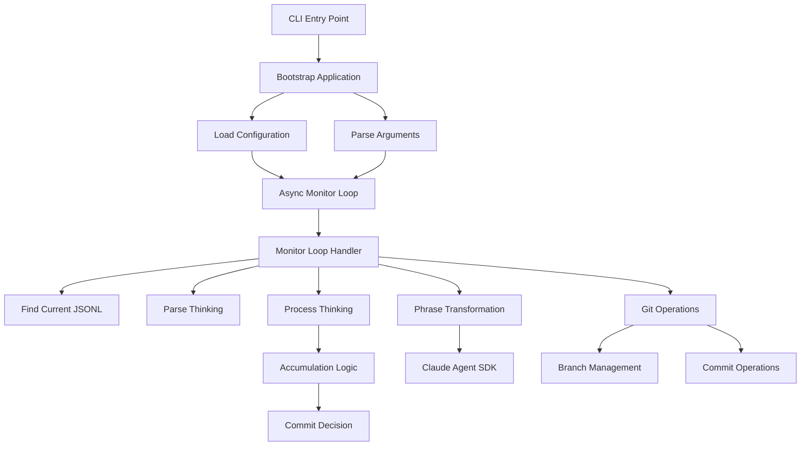
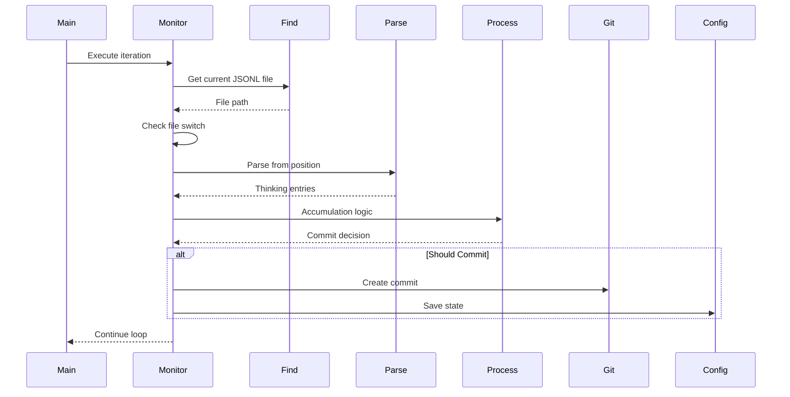
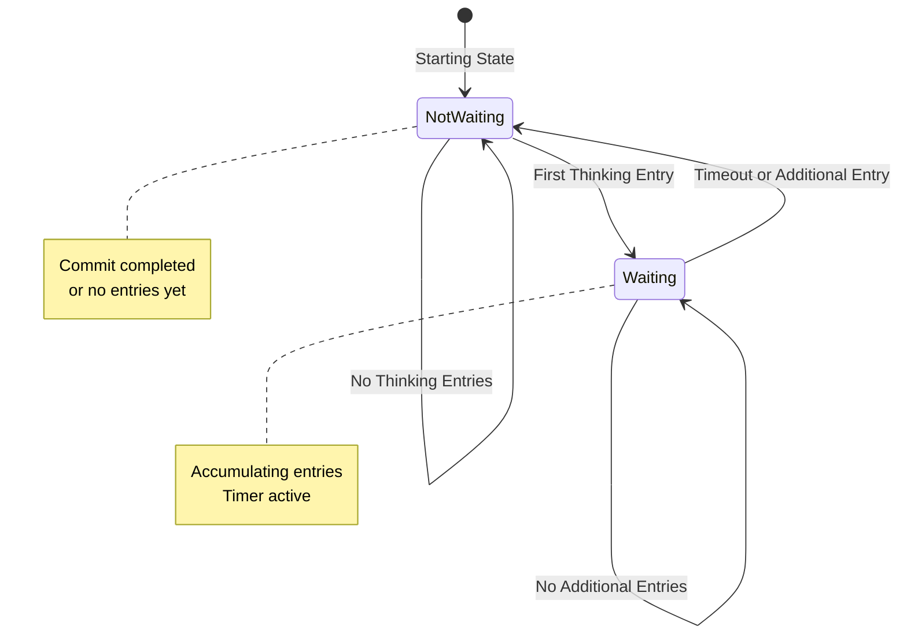
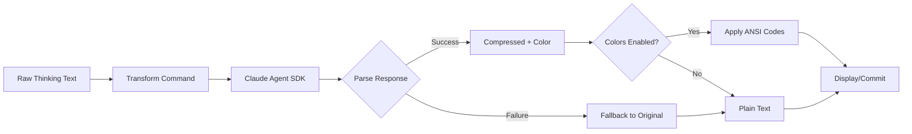

# ccthink Architecture

## Design Overview

ccthink follows a **feature-based vertical slice architecture** with a strict **command-handler** design approach. Each feature encapsulates its complete functionality from input validation through business logic to output generation, promoting high cohesion and low coupling.

### Architectural Principles

1. **Vertical Slices**: Features are self-contained units with all layers (command, handler, response)
2. **Command-Handler Approach**: Every operation is modeled as a command with a dedicated handler
3. **Immutable Commands**: Input parameters are immutable dataclasses
4. **Static Handlers**: Handlers are stateless static classes (pure functions)
5. **Explicit Responses**: All handlers return typed response objects
6. **Type Safety**: Full Pydantic validation with Python type hints

## Component Structure

### High-Level Architecture



### Directory Structure

```
src/
├── ccthink.py                    # Script entry point
├── main.py                       # Application orchestration
├── shared/
│   ├── models.py                 # Pydantic data models
│   └── constants.py              # Application constants
└── features/
    ├── app/bootstrap/            # Application initialization
    ├── cli/parse_arguments/      # CLI argument parsing
    ├── config/
    │   ├── load_config/          # Configuration loading
    │   └── save_config/          # Configuration persistence
    ├── git_operations/
    │   ├── ensure_branch/        # Branch creation
    │   ├── commit_thinking/      # Commit operations
    │   └── merge_branch/         # Branch merging
    ├── gitignore/                # .gitignore management
    ├── monitoring/
    │   ├── find_current_jsonl/   # JSONL file discovery
    │   ├── parse_thinking/       # JSONL parsing
    │   └── monitor_loop/         # Main monitoring cycle
    ├── phrase_transformation/
    │   ├── transform_thinking/   # Sonnet compression
    │   ├── compress_phrase/      # Compression options
    │   ├── colored_output/       # ANSI color formatting
    │   └── line_formatter/       # Line wrapping/formatting
    └── processing/
        └── process_thinking/     # Accumulation logic
```

## Key Abstractions

### Command-Handler-Response Design

Every feature operation follows this structure:

```python
# 1. Command: Immutable input
@dataclass
class OperationCommand:
    input_param: str
    config: Config

# 2. Handler: Pure business logic
class OperationHandler:
    @staticmethod
    def handle(command: OperationCommand) -> OperationResponse:
        # Business logic here
        return OperationResponse(result=value)

# 3. Response: Typed output
@dataclass
class OperationResponse:
    result: str
    success: bool = True
```

### Core Data Models

#### Config

Application-wide configuration with Pydantic validation:

```python
class Config(BaseModel):
    # State tracking
    last_processed_uuid: str
    last_file_position: int
    monitored_file: str

    # Accumulation state
    waiting_for_thinking: bool
    accumulated_thinking: list[str]
    waiting_target_uuid: str

    # Feature flags
    commit_enabled: bool
    sonnet_enabled: bool
    sonnet_streaming: bool
    sonnet_colors: bool

    # Configuration
    poll_interval_seconds: float
    thinking_line_max_length: int
    thinking_separator: str
    main_branch: str
```

#### ThinkingEntry

Parsed JSONL conversation entry:

```python
class ThinkingEntry(BaseModel):
    parent_uuid: str
    type: str
    message: Message
    timestamp: str

    def get_thinking_content(self) -> str | None:
        # Extract thinking from message content
```

#### Message & MessageContent

Nested structure for conversation messages:

```python
class MessageContent(BaseModel):
    type: str  # "thinking", "text", etc.
    thinking: str | None

class Message(BaseModel):
    role: str  # "assistant", "user"
    content: list[MessageContent] | str
```

## Data Flow

### Main Monitoring Loop



### Thinking Accumulation Flow



### File Switch Handling

When switching between conversation files (JSONL):

1. **Detect Switch**: Compare current file to monitored file
2. **Commit Pending**: If waiting, commit accumulated thinking
3. **Merge Branch**: Merge previous conversation branch to main
4. **Reset State**: Clear accumulation, reset file position
5. **Restart Monitoring**: Begin monitoring current file

### Phrase Transformation Pipeline

When Sonnet compression is enabled:



## State Management

### Configuration Persistence

Configuration is saved at multiple trigger points:

- After file switch
- After commit operation
- After accumulation state change
- On graceful shutdown

Persistence locations:

- **Per-project**: `./ccthink.conf` (working directory)
- **Global**: `~/.config/ccthink/config.json`

### File Position Tracking

File position (`last_file_position`) is maintained to enable incremental reading:

1. **Starting Read**: Start at `0` or stored position
2. **Parse Entries**: Read from position to EOF
3. **Update Position**: Store current file size
4. **Next Iteration**: Read from stored position

This approach avoids re-parsing the entire file on each poll.

### UUID Tracking

UUIDs (`parent_uuid`) identify conversation turns:

- `last_processed_uuid`: Last thinking entry successfully committed
- `waiting_target_uuid`: Target UUID when accumulation completes

UUIDs ensure:

- No duplicate commits
- Correct ordering of thinking entries
- Recovery after restarts

## Error Handling Strategy

### Graceful Degradation

The system prioritizes availability over strict correctness:

```python
# File not found → Wait for next poll
if not jsonl_path:
    return Response(should_continue=True)

# Parse error → Skip entry, continue
try:
    entry = parse_entry(line)
except ParseError:
    logger.warning("Skipped malformed entry")
    continue

# Transform failure → Use original text
try:
    compressed = transform(thinking)
except TransformError:
    compressed = thinking
```

### Git Operation Safety

Git operations use subprocess with validation:

```python
# Explicit command validation
subprocess.run(
    ["git", "add", "-A"],  # noqa: S607
    capture_output=True,
    check=True
)

# Handle "nothing to commit" gracefully
if "nothing to commit" in result.stdout.lower():
    return Response(success=True, nothing_to_commit=True)
```

### Merge Conflict Handling

Two strategies for merge conflicts:

1. **Quit Mode** (`quit_on_conflict=True`): Exit immediately
2. **Continue Mode** (`quit_on_conflict=False`): Log error, continue monitoring

## Performance Considerations

### Async Architecture

Async/await enables non-blocking operations:

```python
async def main_loop():
    while not shutdown_event.is_set():
        await monitor()  # Non-blocking
        await asyncio.wait_for(
            shutdown_event.wait(),
            timeout=poll_interval
        )
```

### Incremental File Reading

Only read content since last position:

```python
# Efficient incremental read
current_size = file.stat().st_size
if current_size <= last_position:
    return  # No changes

# Read only from last position
file.seek(last_position)
content = file.read()
```

### Streaming Output

When streaming is enabled, compressed phrases are displayed as they arrive:

```python
# Stream each token as received
async for token in agent.stream():
    print(token, end="", flush=True)
```

### Configuration Caching

Configuration is loaded once and cached in memory:

```python
# Load once at startup
config = Config.load_from_file(config_path)

# Update in memory
config.waiting_for_thinking = True

# Persist periodically
SaveConfigHandler.handle(SaveConfigCommand(config=config))
```

## Security Model

### Local File System Isolation

- **Read Access**: Limited to `~/.claude/projects/` directory
- **Write Access**: Configuration in user-local directories only
- **No Network**: Except Claude Agent SDK API calls

### Subprocess Validation

All subprocess calls are validated:

```python
# Explicit command arrays (not shell strings)
subprocess.run(
    ["git", "commit", "-m", message],  # noqa: S607
    capture_output=True,
    check=False  # Manual error handling
)
```

### Configuration Security

- No secrets stored in configuration files
- API keys managed by Claude Agent SDK
- File permissions: User-readable/writable only

## Validation Strategy

### Unit Checks

Each command-handler pair has isolated unit checks:

```python
def verify_process_thinking_first_entry():
    command = ProcessThinkingCommand(
        entries=[thinking_entry],
        config=Config()
    )
    response = ProcessThinkingHandler.handle(command)
    assert response.should_start_timer
    assert not response.should_commit
```

### Integration Checks

End-to-end checks validate full workflows:

```python
async def verify_monitor_loop_full_cycle():
    # Create JSONL file with thinking
    # Run monitor loop iteration
    # Verify git commit created
    # Verify state persisted
```

### Fixture Management

Pydantic models enable easy fixture creation:

```python
def create_thinking_entry(
    uuid: str = "sample-uuid",
    thinking: str = "Example thinking"
) -> ThinkingEntry:
    return ThinkingEntry(
        parent_uuid=uuid,
        type="assistant",
        message=Message(
            role="assistant",
            content=[MessageContent(
                type="thinking",
                thinking=thinking
            )]
        ),
        timestamp="2025-01-01T00:00:00Z"
    )
```

## Extensibility Points

### Custom Transformation Providers

Replace Sonnet with alternative compression engines:

```python
class CustomTransformHandler:
    @staticmethod
    async def handle(
        command: TransformThinkingCommand
    ) -> TransformThinkingResponse:
        # Custom compression logic
        return TransformThinkingResponse(...)
```

### Accumulation Strategies

Implement alternative accumulation logic:

```python
class CountBasedAccumulationHandler:
    @staticmethod
    def handle(
        command: ProcessThinkingCommand
    ) -> ProcessThinkingResponse:
        # Commit every N entries
        if len(command.entries) >= threshold:
            return Response(should_commit=True, ...)
```

### Output Formatters

Add alternative output formats:

```python
class MarkdownFormatter:
    def format(self, thinking: str) -> str:
        # Convert to markdown
        return f"### Thinking\n\n{thinking}\n"
```

## Future Architecture Improvements

### Event-Driven Architecture

Replace polling with file system events:

```python
from watchdog.observers import Observer

observer = Observer()
observer.schedule(handler, path, recursive=False)
observer.start()
```

### Plugin System

Enable user-defined plugins:

```python
class PluginInterface:
    def on_thinking_parsed(self, entry: ThinkingEntry):
        pass

    def on_commit_created(self, message: str):
        pass
```

### Multi-Project Support

Monitor multiple projects concurrently:

```python
async def monitor_all_projects():
    tasks = [
        monitor_project(project1),
        monitor_project(project2),
        monitor_project(project3)
    ]
    await asyncio.gather(*tasks)
```

### WebSocket Integration

Real-time updates from Claude Code:

```python
async def websocket_monitor():
    async with websockets.connect(url) as ws:
        async for message in ws:
            process_thinking(message)
```
